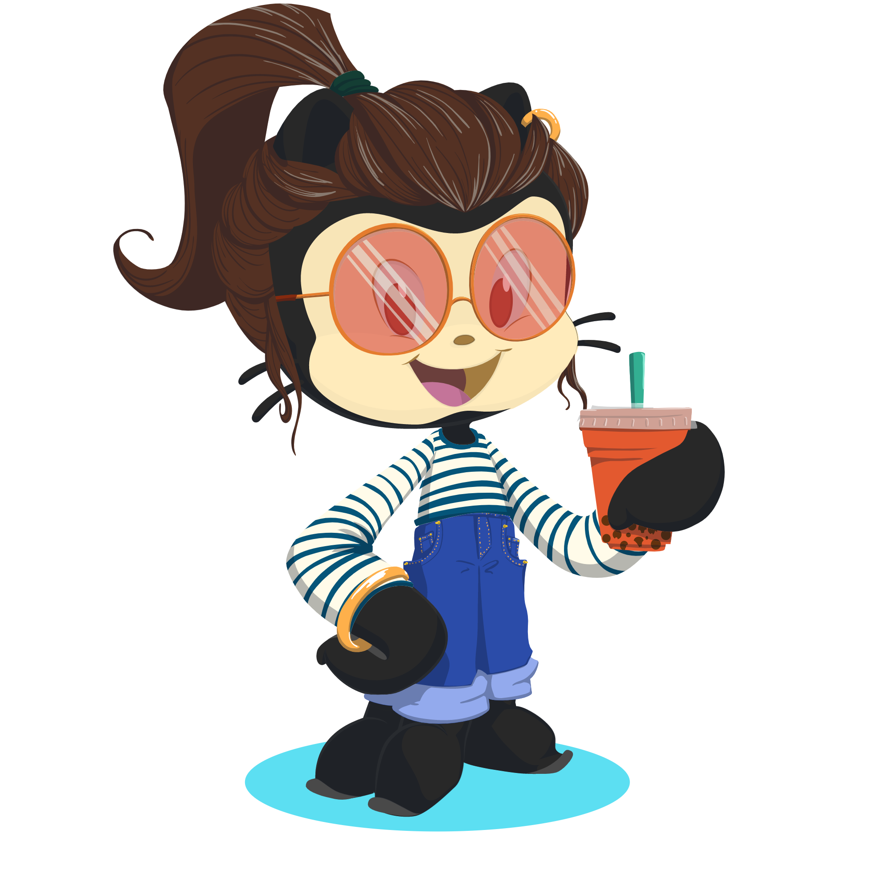
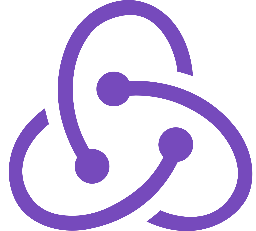
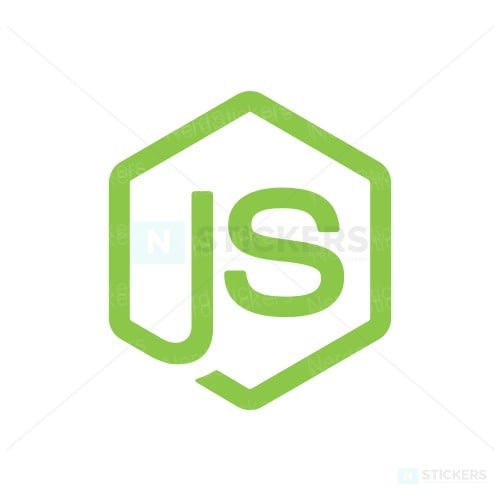

### Hi there 👋

# :corn: Kissyla Motta Pereira :corn:
#### *Student at TRYBE to become a full-stack developer*
:dart: ***Open to Work***

##### WHAT YOU WILL FIND

- Personal projects
- Curiosities about me
- Developer skills

##### A LITTLE ABOUT ME

- :computer:  Currently studying software development at TRYBE
- :heart:  Passionate for technologies and optimizations
- :recycle:  Always learning, practicing and growing up
- :mortar_board: Industrial Engineer and swimmer :swimmer:

##### MAIN SKILLS

&nbsp;&nbsp;&nbsp;

&nbsp;&nbsp;&nbsp;

&nbsp;&nbsp;&nbsp;

&nbsp;&nbsp;&nbsp;

&nbsp;&nbsp;&nbsp;

&nbsp;&nbsp;&nbsp;

##### OTHERS

&nbsp;&nbsp;&nbsp;

&nbsp;&nbsp;&nbsp;

&nbsp;&nbsp;&nbsp;

&nbsp;&nbsp;&nbsp;

##### FOLLOW ME ON

